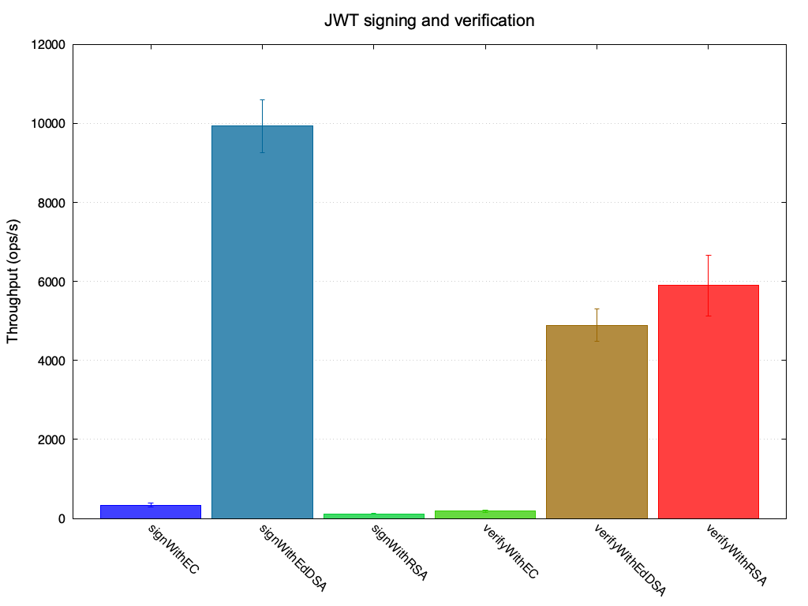

# jmh-plot

A command-line tool to render [JMH](https://github.com/openjdk/jmh) benchmark
results using [gnuplot](http://www.gnuplot.info/).



## How to use

When you run JMH (or [sbt-jmh](https://github.com/sbt/sbt-jmh)), pass these
arguments to make JMH write its results to a JSON file:

```
-rf json -rff my-benchmarks.json
```

Then feed that JSON file to `jmh-plot`:

```
java -jar jmh-plot.jar my-benchmarks.json
```

`jmh-plot` will print a gnuplot script to stdout, so you can pipe it straight
into `gnuplot`:

```
java -jar jmh-plot.jar my-benchmarks.json | gnuplot
```

## CLI options

```
Usage: jmh-plot [--title <string>] <input file>

Render your JMH benchmark results using gnuplot

Options and flags:
    --help
        Display this help text.
    --title <string>
        Title to display above the plot
```

## How to build

```
sbt assembly
```

## Future work

* Scala Native
* Support benchmarks with parameters
* Figure out a good way to distribute the tool. Coursier? Scala Native binaries
  on GitHub releases?
